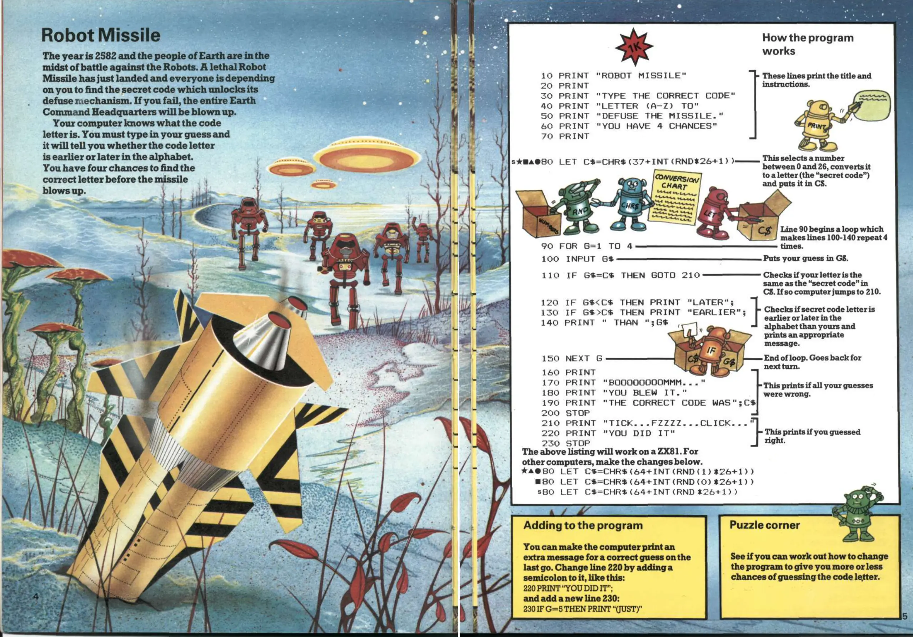

# Robot Missile

Introducing my version of the classic "Robot Missile" game from Usborne's Computer Battlegames. Originally designed for microcomputers such as the ZX81, ZX Spectrum, BBC, VIC 20, TRS-80, Pet, and Apple micros, I've decided to recreate this simple yet fun game using JavaScript and React.

[Demo](https://robot-missile.netlify.app/)

### How it works

> You must type in your guess and the computer will tell you whether the code letter is "earlier" or "later" in the alphabet. You have four chances to find the correct letter before the missile blows up.

### Built with

- HTML
- CSS Custom Properties
- JavaScript
- React
